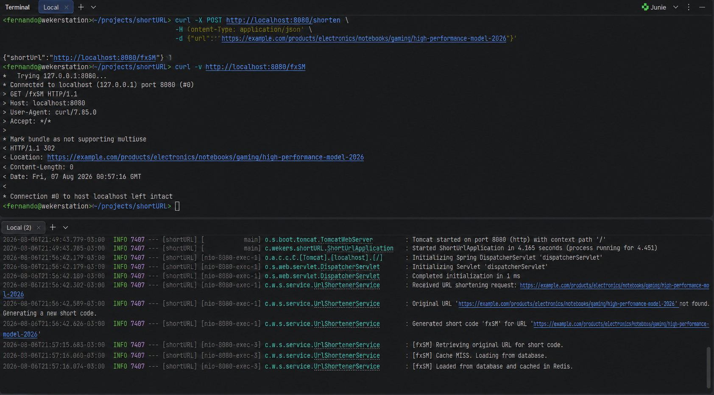
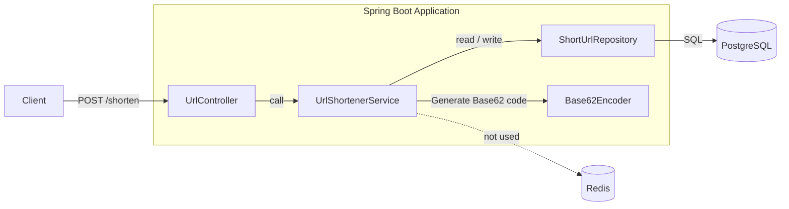
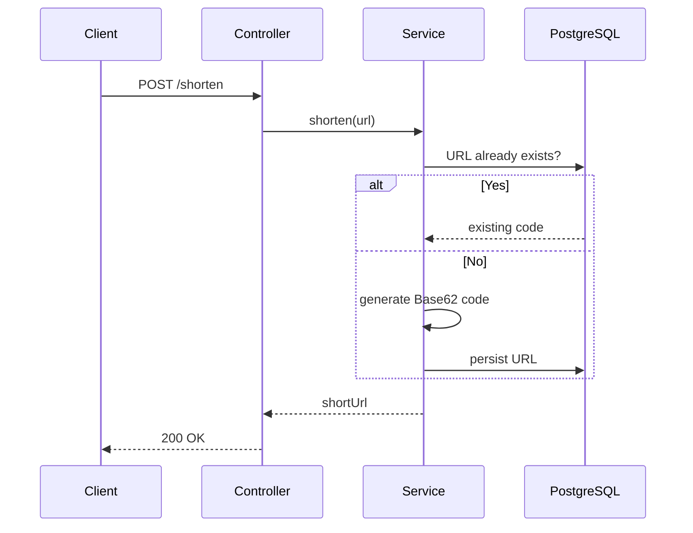
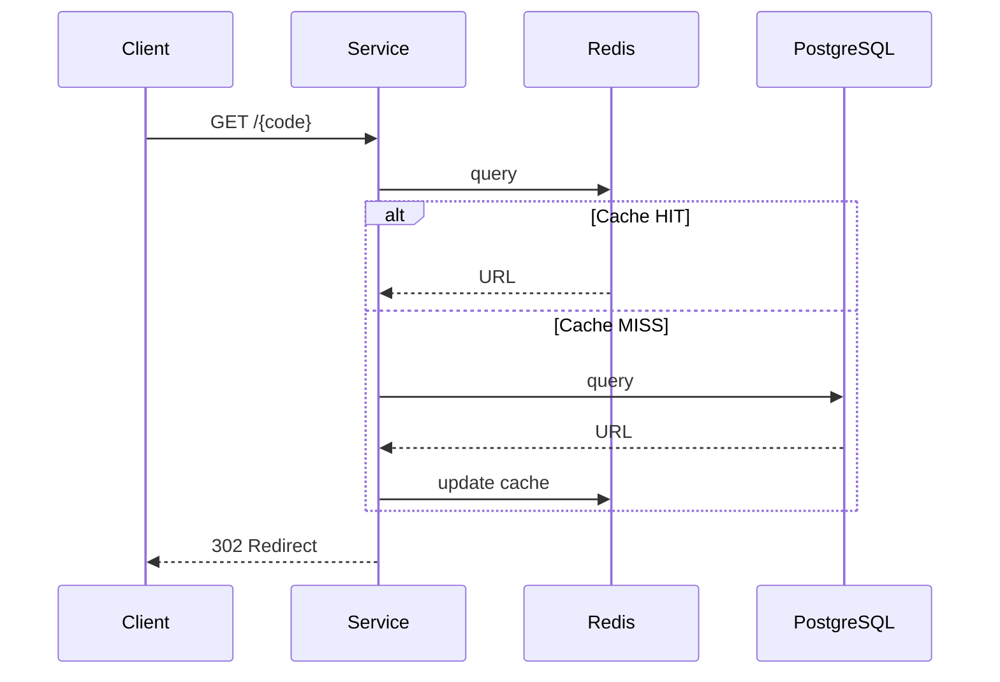
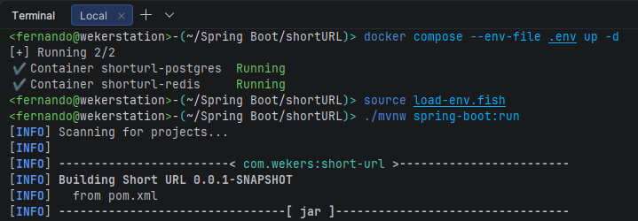
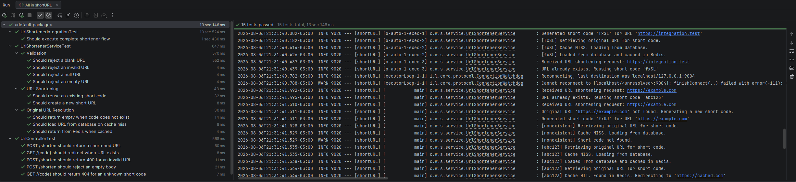

# 🔗 Short URL

[](https://github.com/wekers/shortURL/actions/workflows/build.yml)
[](https://openjdk.org/)
[](https://spring.io/projects/spring-boot)
[](https://www.postgresql.org/)
[](https://redis.io/)
[](https://www.docker.com/)
[](LICENSE)

A lightweight URL shortening service built with Spring Boot 4.1.

This project demonstrates the implementation of a RESTful API using:

- Base62 encoding
- Cache Aside pattern with Redis
- PostgreSQL persistence
- Docker Compose
- Unit, Controller and Integration Tests with Testcontainers


```text
                ┌─────────────┐
                │   Client    │
                └──────┬──────┘
                       │
                POST /shorten
                GET /{code}
                       │
              ┌────────▼────────┐
              │ Spring Boot API │
              └────────┬────────┘
                       │
             ┌─────────┴─────────┐
             ▼                   ▼
        PostgreSQL             Redis
     Persistent Store          Cache
```
---
## Example

The following example shows the complete request flow:

1. Create a shortened URL
2. Access the generated short URL
3. Receive an HTTP 302 redirect
4. Observe the Cache-Aside flow (Redis → PostgreSQL → Redis)



---
## Architecture

### Component Diagram - URL Shortening Flow

### URL Shortening Sequence:


### URL Redirect Flow (Cache Aside)


---

## Technologies
- Java 21
- Spring Boot 4.1
- Spring MVC
- Spring Data JPA
- Spring Data Redis
- PostgreSQL
- Redis
- Docker Compose
- JUnit 5
- Mockito
- MockMvc
- WebTestClient
- Testcontainers
---
## Project Structure:

```text
src
 main
 ├── config
 ├── controller
 ├── dto
 ├── entity
 ├── repository
 ├── service
 └── util
 test
 ├── controller
 ├── integration
 └── service
```
--- 
## Getting Started:

```bash
# Clone the Repository
git clone https://github.com/wekers/shortURL.git
cd shortURL/
```

Copy the example environment file:

```bash
cp .env.example .env
```

Edit the `.env` file if you wish to change the PostgreSQL credentials.
## Starting the infrastructure

```bash
docker compose --env-file .env up -d
```

Check containers:

```bash
docker ps
```

## Running the application



Load the environment variables:

* For Bash/Zsh:

```bash
export $(grep -v '^#' .env | xargs)
```

* For Fish shell (use a helper file):
```bash
source load-env.fish
```

Run the application:

```bash
./mvnw spring-boot:run
```

## Redis Insight

**Redis Stack Web UI:**

http://localhost:8001

## Endpoints


### Shorten URL

```bash
curl -X POST http://localhost:8080/shorten \
  -H "Content-Type: application/json" \
  -d '{"url":"https://example.com/products/electronics/notebooks/gaming/high-performance-model-2026"}'
```

Response:

```json
{
  "shortUrl": "http://localhost:8080/fxSM"
}
```

### Redirect to Original URL

```bash
curl -v http://localhost:8080/fxSM
```

Response:

```
HTTP/1.1 302 Found
Location: https://example.com/products/electronics/notebooks/gaming/high-performance-model-2026
```


---
### Testing

```bash
./mvn test
```


| Type        | Frameworks                                          |
| ----------  | --------------------------------------------------- |
| Unit        | JUnit + Mockito                                     |
| Controller  | MockMvc                                             |
| Integration | WebTestClient + Testcontainers (PostgreSQL + Redis) |


---

### Roadmap


- [x] URL Shortening
- [x] PostgreSQL
- [x] Redis
- [x] Docker Compose
- [x] Unit Tests
- [x] Controller Tests
- [x] Integration Tests
- [x] Testcontainers
- [x] GitHub Actions
- [x] Build Badge

## Future Improvements

- [ ] API documentation (OpenAPI / Swagger)
- [ ] Metrics with Micrometer + Prometheus
- [ ] Docker image publishing
- [ ] Deployment to a cloud provider

## License

MIT
